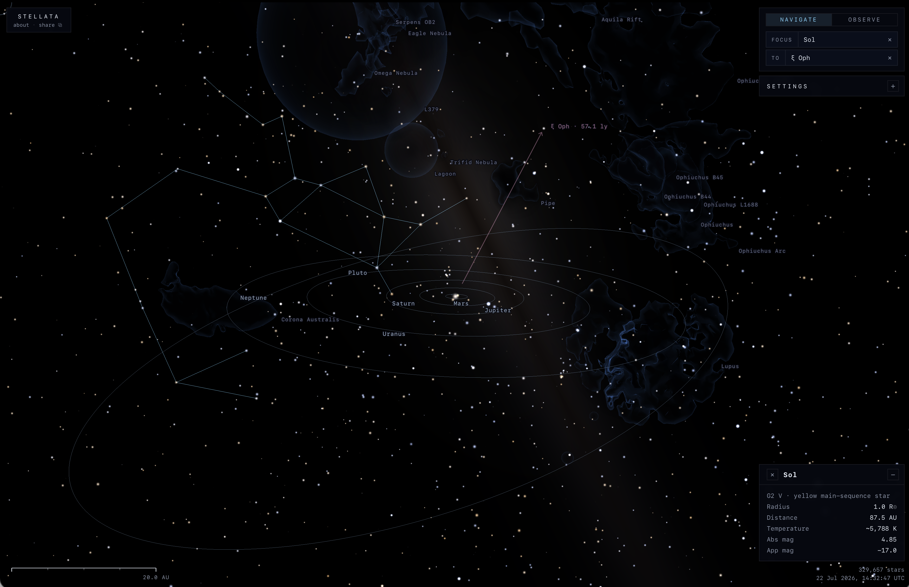
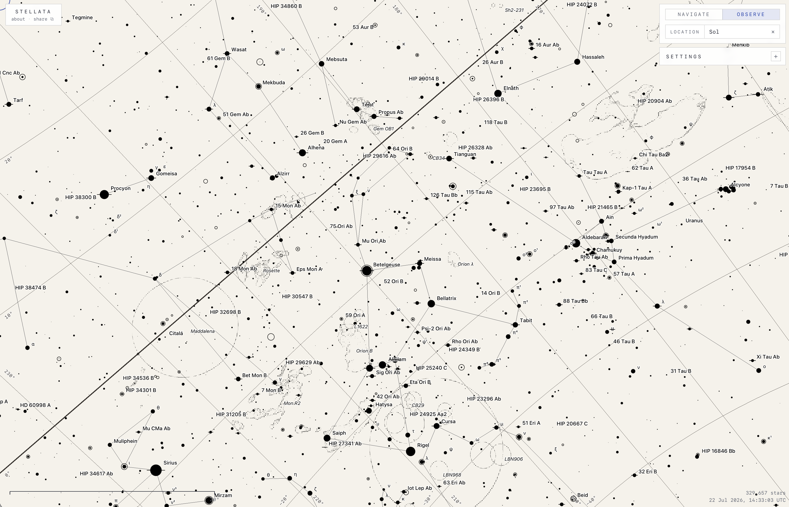

# Stellata

*Explore the universe.*

A physically accurate 3D model of our local corner of the universe at every
scale astronomy has measured it. Experience what it would actually look
like to *be there*: from individual stars and their planets, through the local
interstellar medium, out to the structure of the galactic disc, and
beyond into the intergalactic void.

Every object in Stellata comes from a published observational
catalogue and direct measurement: if we've measured it, it's
here. Theoretical predictions and conjectured structures are excluded. The
model's scope is bounded by what has been observed, currently enclosing
a volume up to 6.5 million light years from our solar system.

Try it at **[https://stellata.xyz](https://stellata.xyz)**.

<!-- view-url: https://stellata.xyz/?v=BIWEIgeSiYo3GAWyOXD4hDkH7eeAPeZqWj7Qlnk_TPbKDwGH1xI -->

## Highlights

- **Everything is rendered live, from where you are.** Over 330,000
  real stars and objects — planets and moons, multiple-star systems,
  the volumetric Milky Way, the Local Group dwarf galaxies, and the 3D
  dust between them continually re-render against the current camera
  position each frame. Fly halfway to Sirius and the sky changes:
  parallax, reddening, and occlusion are all real, not fabricated.

- **Close-up stars resolve as physical objects.** Approach a star and
  it stops being a dot: its disc grows to its actual radius (from
  catalogue absolute magnitude + spectral class via Stefan–Boltzmann)
  and occludes whatever is behind it. Supergiants like Betelgeuse
  fill half the viewport; white dwarfs render as crisp small points.

- **Interstellar dust dims and reddens stars correctly.** The vertex
  shader raymarches the Edenhofer 2023 3D dust map from camera to
  star at run time, so stars behind dense ISM look fainter and
  redder, exactly as you would see them.

- **Molecular clouds have real shape.** The local star-forming clouds
  (Taurus, Orion, Ophiuchus and their neighbours) render as dust
  silhouettes traced directly from the Edenhofer field, and dim the
  diffuse background behind them.

- **Variable stars pulsate.** ~3,700 stars cross-matched with GCVS
  pulse at their true catalogue period on the model clock — brightness,
  disc radius, and colour all swing together. Open the time scrubber
  (`T`) to accelerate time and watch a Cepheid or Mira run through a
  cycle.

- **The solar system at live planetary positions.** Around Sol, the
  eight planets and Pluto render at their current heliocentric
  positions — frozen JPL Horizons element tables across 1900–2100
  (~1,000 km) and the Standish series out to the 3000 BC – 3000 AD
  clamp — with their major moons, atmospheres, and axial
  rotation, inside the asymmetric heliopause shell measured by Voyager
  and IBEX. A small clock in the corner shows the UTC time the
  positions correspond to.

- **The Milky Way is volumetric, not a skybox.** A bounded raymarch
  through galactic-scale density meshes produces the surface-
  brightness band. Fly past the galactic centre and it reorients
  with proper parallax. Analytical mid-plane dust means the dark
  lane reads correctly.

- **A paper-chart mode for when you want to read the sky like a
  star atlas.** A second visual mode is inspired by Sky Atlas 2000.0:
  flat hard-edged discs sized by apparent magnitude, full
  Bayer/Flamsteed labels, constellation names, double-star wings,
  variable-star rings.

<!-- view-url: https://stellata.xyz/?v=BJbEoAQHthJ4Pautez9BzDA-B6R7ob4MQ6w9Q_pxP1o7YQGH1xIB -->

- **Navigate, observe, warp.** Orbit any star (navigate), or land on
  it and look at the sky from its location (observe). Pick a second star
  to measure the distance, then warp: an animated camera flight
  between the two stars with full physical scaling.

- **Shareable views.** All settings plus camera pose pack into the
  current URL, so any view can be bookmarked and shared.

## Grounded in published science

Everything you see is calibrated against the source data. Star sizes
come from absolute magnitudes via Stefan–Boltzmann; halo softness
tracks MK luminosity class; double and multiple stars come from the
Washington Double Star Catalog and ORB6, with Gaia DR3 NSS and the
Pulkovo Multiple Star Catalog for orbits; dwarf galaxies in the Local
Group come from Pace 2024's Local Volume Database with hand-curated
structural detail for the LMC, SMC, M31, M33, and Sagittarius dSph
from the primary literature.

The full record of sources, formulas, and deliberate modelling
simplifications lives in **[SCIENCE.md](./SCIENCE.md)**. Read for
citations, DOIs, and what is and isn't observationally grounded.

## Things to try

Stellata rewards exploration more than reading. A short curated list
of viewpoints and objects, each chosen because it exercises something
the renderer does that doesn't quite show up in a screenshot.

### See the giants as physical objects

Approach these slowly. The discs grow to the star's real radius
computed from its catalogued absolute magnitude and spectral class,
so they fill the viewport long before you'd expect.

- **Betelgeuse (α Orionis)** — the canonical red supergiant.
  M2 Ia at 152 pc; the disc resolves to a large fraction of the
  viewport at close range.
- **Antares (α Scorpii)** — the other canonical red supergiant.
  M1.5 Iab at 170 pc. Visibly redder than Betelgeuse.
- **Rigel (β Orionis)** — blue supergiant in the same constellation
  as Betelgeuse. B8 Ia at 265 pc, intrinsically brighter than
  Betelgeuse — but hotter, so Stefan–Boltzmann gives it a smaller
  physical radius. The Rigel / Betelgeuse pair makes the L = R²T⁴
  trade-off visible.
- **Deneb (α Cygni)** — A2 Ia supergiant at 433 pc, in Cygnus.
  Renders as a notably bright white-blue disc.

### Watch variables pulse

Variables pulse at their true GCVS period on the model clock. Open the
time scrubber (press `T`) to accelerate time, then focus on one and
watch it swing in brightness, size, and colour:

- **δ Cephei** — the namesake Cepheid.
- **η Aquilae** — another bright classical Cepheid.
- **Mira (o Ceti)** — the long-period prototype; the amplitude is
  dramatic.
- **Betelgeuse** — a slow, low-amplitude pulse, visible as both a
  brightness swing and a physical disc-radius change if you're focused
  close in.

### Fly out and watch the constellations break

The constellation lines come from Earth's viewpoint. Move just a
few tens of parsecs and the figures visibly deform — this is the
moment the model stops being a planetarium and starts being a 3D
map.

- **Orion** — Betelgeuse (~152 pc) and Rigel (~265 pc) are at very
  different distances; flying through Orion stretches the figure
  asymmetrically.
- **Big Dipper / Ursa Major** — most members belong to the Ursa
  Major moving group, but Dubhe (α UMa) and Alkaid (η UMa) don't.
  The asterism breaks lopsidedly as you back away.
- **Cygnus** — Deneb is at ~433 pc, the rest of the Northern Cross
  much closer. Backing the camera off tilts the cross dramatically.

### Visual doubles, in chart mode

Switch to chart mode while observing from a focused star to see
the double-star wings glyph. The model flags ~13,000 doubles via
the Hipparcos CCDM cross-match.

- **Mizar + Alcor (ζ + 80 UMa)** — the classic naked-eye double.
  Both stars are in the catalogue at distinct positions, so they
  render as two separate discs; Mizar additionally carries the
  binary wings glyph in chart mode.
- **Albireo (β¹ + β² Cygni)** — Earth's favourite colour-contrast
  pair, gold and blue. Stellata's 3D positions reveal it as an
  *optical* double rather than a true binary: β¹ at 111 pc, β² at
  122 pc, ~35 light-years apart along the line of sight — far too
  distant to be gravitationally bound. The colour contrast is
  real; the pairing is a chance alignment. (This matches the
  modern post-Gaia consensus, which retired Albireo from binary-
  catalogue status around 2018.)
- **ε Lyrae** — the wide "double double" pair. ε¹ and ε² Lyr are
  catalogued separately and render as a visible naked-eye pair;
  each carries the binary wings glyph in chart mode (each is itself
  a close binary that Hipparcos resolves).

### Beyond the heliopause

The default first-load view parks you 5 AU from Sol facing the
galactic centre — a deliberate "you are here, that's our system"
anchor. From there:

- **From Pluto, looking inward.** The Sun is just one bright star
  among many; the heliopause shell sits overhead.
- **Cross the heliopause at the upwind apex (~122 AU) and look
  back.** The model's asymmetry — ~115 AU at the flanks, ~200 AU
  into the heliotail — reads from outside the bubble.

### Watch the dust shape the sky

Set the magnitude limit to "All" (showing all ~330,000 stars) and
pull the camera out to ~3 kpc from Sol, then orbit around. The
Edenhofer 2023 3D dust grid is real volumetric structure, not an
analytical shell — as you move, extinction patterns paint
themselves across the stellar density as filaments and clumps that
follow the actual local ISM. Stars behind dense lanes dim and
redden; stars in clear windows shine through. Combined with the
live per-camera apparent-magnitude recomputation (further =
dimmer), the effect reads more like a map of the local ISM than a
star-chart background.

### Galactic-scale views

The Milky Way is volumetric, not a skybox. These viewpoints prove it:

- **Park 8 kpc above the galactic centre and look down.** The disc
  and bulge render as illuminated 3D structures; their orientation
  responds to camera motion.
- **Stand on a star a few kpc out and look around.** The MW band
  wraps continuously, with parallax that wouldn't be possible from
  a flat backdrop.
- **Fly toward the galactic centre.** As you cross into the bulge,
  the surface brightness of the volumetric band ramps. The dark
  dust lane along the midplane (a Drimmel–Spergel analytical
  profile baked into the band's own raymarch) reads correctly as
  you orient along the disc plane.

### Local Group destinations

For ambitious distances. The Local Group layer renders LineLoop
wireframes for confirmed-galaxy members out to 2 Mpc.

- **Sagittarius dSph** (~26 kpc) — our closest companion dwarf,
  currently being tidally torn apart by the MW. The wireframe shows
  the elongated structural axis that captures.
- **LMC / SMC** (~50 / 63 kpc) — the Magellanic Clouds render with
  hand-curated structure (LMC: inclined disc at i = 32°; SMC:
  triaxial along line of sight) rather than the default oblate
  ellipsoid.
- **M31 (Andromeda, 776 kpc) and M33 (Triangulum, 840 kpc)** — the
  two major spirals beyond the MW; M31's inclined disc (i = 77°) is
  visible.

## Browser support

- **WebGL2** required (any browser from 2018 onward — Safari 15+,
  Chrome 56+, Firefox 51+).
- Loads and renders on any device, but the user interface for mobile
  devices / small viewports is currently pending a future update.

## Gestures

The two-finger rotate gesture (roll the view around the screen
centre) is available on:

- **Mobile / touch** — iOS Safari, Android Chrome, any browser that
  exposes multi-touch `touchmove` events.
- **Desktop Safari** — via the macOS trackpad two-finger rotate
  gesture, detected through Safari's non-standard `gesturechange`
  event.

Chrome and Firefox on desktop do **not** expose a rotate gesture
(they consume two-finger trackpad input for scroll/pinch only), so
roll is unavailable in those browsers by design. All other
navigation (orbit, zoom, pan) works the same everywhere.

## Known limitations

- **Only ~3,700 variables pulse** — those successfully cross-matched
  between AT-HYG (via HIP or HD) and GCVS. Variables without a
  HIP/HD cross-reference, or whose GCVS entry lacks a parseable
  period, render as non-variable.
- **Emission and reflection nebulae are not modelled yet.** The local
  molecular clouds (Zucker 2020/2021) now render as traced dust
  silhouettes, but catalogued H II regions, planetary nebulae, and
  reflection nebulae are not yet drawn as discrete objects.

## Sponsorship

Stellata is built and maintained in my spare time. If it's useful to
you and you'd like to support continued development, sponsorship
through [GitHub Sponsors](https://github.com/sponsors/alexmensch) is
warmly welcomed.

## Contributing

The issue tracker is open. Bug reports and enhancement suggestions
are welcome. External pull requests are not currently accepted; see
[`.github/CONTRIBUTING.md`](.github/CONTRIBUTING.md) for the full
rationale and how to write a useful bug report or feature request.

## Licence

The code in this repository is licensed under AGPL-3.0-only. See
[`LICENSE`](./LICENSE).

Data sources retain their own licences:

- **AT-HYG v3.3** (stellar catalogue) — David Nash,
  [Codeberg](https://codeberg.org/astronexus/athyg), CC-BY-SA-4.0.
  The generated `catalog.bin` and `search-index.json` are
  derivatives and carry the same licence.
- **Gaia DR3** (astrometry, broadband photometry, astrophysical
  parameters, NSS orbits) —
  ESA / Gaia / DPAC, [Gaia archive](https://gea.esac.esa.int/archive/),
  CC-BY-4.0 (Gaia data-release policy).
- **Riello et al. 2021** (Gaia EDR3 photometric relations — the
  `G` → Johnson `V` transform every star's brightness is derived
  through) — cite the paper
  ([10.1051/0004-6361/202039587](https://doi.org/10.1051/0004-6361/202039587)).
- **Bailer-Jones et al. 2021** (Gaia DR3 geometric distances) — via
  [CDS/VizieR](https://cdsarc.cds.unistra.fr/viz-bin/cat/I/352); cite
  the paper ([10.3847/1538-3881/abd806](https://doi.org/10.3847/1538-3881/abd806)).
- **SIMBAD** (cross-identifications + validation sample) — CDS
  Strasbourg, [simbad.cds.unistra.fr](https://simbad.cds.unistra.fr/simbad/);
  publicly accessible per CDS policy (academic / non-commercial), cite
  Wenger et al. 2000.
- **GCVS 5.1** (variable stars) — Samus et al at the Sternberg
  Astronomical Institute, [http://www.sai.msu.su/gcvs/gcvs/](http://www.sai.msu.su/gcvs/gcvs/).
  Free for research and educational use with attribution.
- **Hipparcos Main Catalogue + CCDM** (ESA SP-1200, 1997; Dommanget
  & Nys 1994) — printed Johnson `V` for the stars Gaia's detectors
  saturate on, plus the double-star cross-match. Public domain via
  [CDS](https://cdsarc.cds.unistra.fr/viz-bin/cat/I/239).
- **Washington Double Star Catalog + ORB6** (double-star geometry and
  visual orbits) — U.S. Naval Observatory,
  [astro.gsu.edu/wds](http://www.astro.gsu.edu/wds/); public domain
  (U.S. Government work).
- **Multiple Star Catalog** (hierarchical multiple-star orbits) —
  Tokovinin 2018, via CDS/VizieR (`J/ApJS/235/6`); standard academic
  use, cite the paper.
- **Stellarium modern sky culture** (constellation stick figures) —
  [Stellarium](https://github.com/Stellarium/stellarium/tree/master/skycultures/modern),
  MIT-licensed (line data; illustrations not used).
- **Edenhofer et al. 2023 3D dust map** —
  [Zenodo](https://doi.org/10.5281/zenodo.8187943), CC-BY-4.0. The
  resampled voxel grid in `data/dust/` is a derivative and carries
  the same licence.
- **Pace 2024 Local Volume Database** (dwarf galaxies) —
  [arXiv:2411.07424](https://arxiv.org/abs/2411.07424), CC0. The
  `dwarf_all` snapshot at `data/local-group/lvdb-snapshot.csv` is a
  frozen copy of the upstream table.
- **Zucker 2020 + 2021** (molecular cloud distances and bounding
  boxes) —
  [10.3847/1538-4357/ab9d24](https://doi.org/10.3847/1538-4357/ab9d24)
  and [10.3847/1538-4357/ac1f96](https://doi.org/10.3847/1538-4357/ac1f96).

See [SCIENCE.md](./SCIENCE.md) and
[docs/science-local-group.md](./docs/science-local-group.md) for
citation details and the peer-reviewed papers underpinning
hand-curated Local Group overrides (LMC, SMC, M31, M33, Sgr dSph,
M 32, NGC 205).
