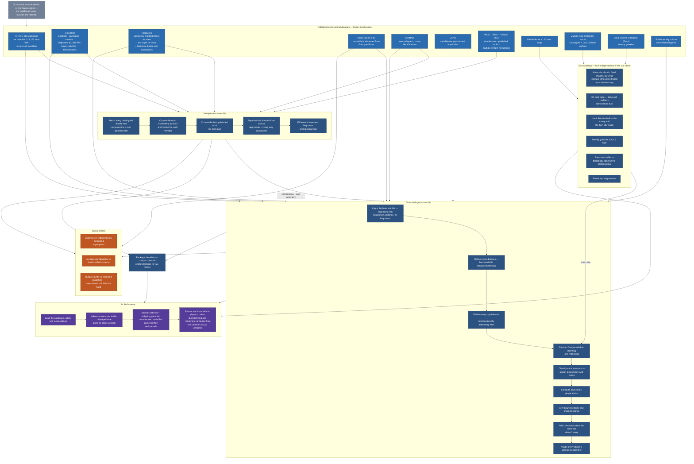

# How Stellata's catalogue is built

A plain-language walkthrough of the data pipeline: which published
astronomical datasets go in, what decisions the build makes along the
way, and what the viewer in your browser finally loads. It is written
for a reader who knows the data sources — or is simply curious — but
not this codebase. Citations and the physical rationale behind each
decision live in `SCIENCE.md` and its per-topic companions.

The flowchart renders natively in GitHub's markdown viewer.

## The sources, and keeping them fresh

Every input is a frozen local copy of a published dataset, so the
build is reproducible and never depends on a remote service being up.
A separate set of manual refresh scripts re-downloads the Gaia-era
sources (Gaia, Hipparcos, SIMBAD, Bailer-Jones, the Pulkovo multiple-
star compilation) when something upstream changes — infrequently, and
always as a deliberate, reviewed step. The base star list itself is
swapped only when a new AT-HYG release lands.

## Multiple-star assembly

Double-star catalogues describe *observations* — "a companion at this
separation and angle" — not identified stars, so the first job is
deciding which real star each catalogued component actually is. Every
component is matched to a Gaia source through a ladder of
identifications (a published orbit's Hipparcos ID, the base
catalogue's own Gaia ID, SIMBAD cross-identifications, Hipparcos
double-star records), and every candidate match must pass a brightness
sanity check: a claimed match more than a magnitude fainter than the
star it is supposed to be is really a companion or a background
interloper that an automated cross-match landed on, and is rejected.

Each member then gets the most trustworthy position and motion
available. Gaia is the default; the exceptions are stars whose Gaia
fit is corrupted by unmodelled orbital motion (Gaia's centre-of-mass
solution is used where it has one, Hipparcos's longer baseline where
it doesn't) and stars too bright for Gaia altogether, which also fall
back to Hipparcos.

Each pair gets the best published orbit: a visual orbit from the orbit
catalogue first, then a Gaia orbital fit, then a spectroscopic orbit,
then a compiled literature orbit for pairs too tight to resolve.

Most catalogued "doubles" are chance alignments, so every pair runs a
physical-vs-optical gauntlet: cataloguers' own notes, whether an orbit
is on file, a hard separation limit (no pair wider than one parsec
survives the Galaxy's tides), parallax agreement plus relative
velocity against escape velocity, and common-proper-motion tests.
Only pairs judged genuinely bound are kept.

Finally each member is given a brightness and a spectral type from the
best available source, preferring measured values and being explicit
about what was inherited or derived, and the results are written out
as a table of physically bound systems.

## Star-catalogue assembly

The base list contributes identity: which stars exist, and their names
and designations. Almost everything else is re-derived from better
sources.

**Brightness.** A star's visual (Johnson V) magnitude is transformed
from Gaia's own broadband measurements through a published relation
(Riello et al. 2021) — that covers 310,939 of the 313,257 stars. Gaia's
detectors saturate on the brightest stars, so those fall back to
Hipparcos' printed V, and a residual 144 take the base catalogue's
printed magnitude. Intrinsic brightness is always *derived* from that
magnitude and the distance the refinements below settled on, never read
from a table, so a star cannot be placed at one distance and lit for
another.

**Distances.** A star's naive distance (one over its parallax) is
biased and noisy, so distances are refined in a fixed order: the
Bailer-Jones probabilistic distance replaces the naive value for
Gaia-sourced stars; Hipparcos-sourced stars get their distance
re-derived at full precision from the original parallax; stars in the
direction of the Large Magellanic Cloud that also share its motion are
snapped to its precisely known distance of 49.6 kpc (from eclipsing
binaries — parallax is useless that far out); and anything still
beyond 50 kpc is out of scope and dropped. Because intrinsic brightness
is derived from the final distance rather than tabulated, a star moved
to a new distance is lit correctly for it by construction.

**Directions.** Sky positions use the same trust ladder as the
multiple-star pipeline: Gaia by default, Gaia's centre-of-mass
solution for binaries whose plain fit is flagged unreliable, Hipparcos
for the saturated bright stars and for stars whose Gaia and Hipparcos
proper motions disagree wildly, and the base catalogue's printed
position for a residual handful. Positions are propagated to a common
epoch, and each star's full 3D space velocity is recorded alongside —
implausible velocities (almost always measurement artifacts) are
zeroed rather than letting stars streak across the model.

**Dust, counted exactly once.** Observed brightness includes dimming
by interstellar dust between the Sun and the star. The viewer,
however, computes dust dimming live from wherever the camera actually
is — so the catalogue stores each star's *intrinsic* brightness and
colour, with the Sun-to-star dust contribution subtracted using the
same 3D dust map the viewer integrates through. From the Sun's
vantage the two operations cancel exactly and you see the star's
catalogued magnitude; from anywhere else, the lighting is physically
consistent with the new sightline.

**Spectra, colour, size.** Each star's spectral classification comes
from curated overrides for a few famous problem cases, then SIMBAD,
then Gaia's own classification. Colour and temperature prefer Gaia's
measured temperature estimates, then the star's observed colour index,
then the colour implied by its spectral class, with white dwarfs on
their own temperature scale and a solar colour as the last resort.
Physical radius follows from luminosity and temperature via the
Stefan-Boltzmann law, with white dwarfs special-cased.

**Coherent systems.** Two members of a bound system carry
independently measured distances whose noise is far larger than the
system's true size, so a naive build renders famous binaries split
visibly apart along the line of sight. Each system's most trustworthy
member becomes the anchor and other members adopt its distance —
unless a member's own parallax disagrees significantly, which is how
genuinely measured depth (Alpha Centauri and Proxima) survives.

**Missing companions.** Thousands of well-known companions — Sirius B,
the components of Algol — have no entry of their own in general star
catalogues. These are minted as first-class objects from the
multiple-star table, positioned from the measured separation and angle
off their primary, and given an honest brightness: a companion never
inherits its primary's full brightness, and a row with no defensible
brightness source is dropped rather than faked. A conservation pass
then dims each primary whose measured magnitude actually included a
now-separate companion's light, so no photon is counted twice — and
only where it really did: where the primary's brightness came from
Gaia, a companion Gaia resolved as its own source was never in there to
begin with, and subtracting it would make the primary too faint.

**Permanent identity.** Every object receives a permanent identifier,
allocated once in a frozen registry, so links and shared views survive
future data updates that reshuffle the underlying catalogues.

The finished catalogue ships with the constellation figures (resolved
from the Stellarium sky culture against the final star list) and a
search index covering proper names, Bayer and Flamsteed designations,
catalogue numbers, and variable-star names.

## Orbits for the viewer

Pairs with usable orbital elements are packaged into a compact file
keyed to the finished catalogue, which is what lets the viewer move
binaries along their true orbits in real time rather than displaying a
frozen snapshot.

## Surroundings

Independently of the star chain, the build prepares the environment
the stars sit in:

- **Molecular clouds** — the named nearby star-forming clouds, with
  precisely fitted shapes where available and, for clouds inside the
  dust map's volume, true irregular silhouettes traced from the dust
  distribution itself.
- **The dust cube** — the 3D dust map resampled into a volume the
  renderer integrates through on every sightline, dimming and
  reddening stars behind dust; the same volume the catalogue build
  used for de-extinction, so the two stay consistent by construction.
- **The Local Bubble** — a closed shell tracing the wall of the
  low-density cavity the Sun sits inside.
- **Nearby galaxies** — confirmed galaxies out to 2 Mpc, each drawn as
  an oriented luminous body.
- **Star colours** — a precomputed table from stellar temperature
  through a blackbody spectrum and the standard human colour-response
  functions to screen colour, so every star renders a physically
  grounded hue.
- **Planet textures** — imagery for the solar-system bodies.

## Cross-checks

Three kinds of independent verification guard the pipeline: refined
distances are compared against supergiants with independently
measured distances; multiple-star identity resolution is compared
against a hand-verified list of famous systems; and every build
asserts its output counts (stars kept, matches made, companions
minted, rows dropped and why) against an expected snapshot, so any
unexplained drift fails the build instead of shipping silently.

## In the browser

The viewer loads the catalogue, the orbit file, and the surroundings.
Star positions advance from the catalogue's reference epoch (2016.0)
to the displayed date along each star's recorded space velocity, and
keep advancing as you scrub time. Binaries with orbits move live along
Kepler orbits; eclipsing pairs dim on schedule; variable stars pulse
with their real periods and amplitudes. Each star is drawn with its
physically derived colour and size, dimmed and reddened by integrating
the dust cube along the sightline from wherever the camera actually is
— so flying somewhere else in the Galaxy re-lights the sky the way it
would really look from there.
