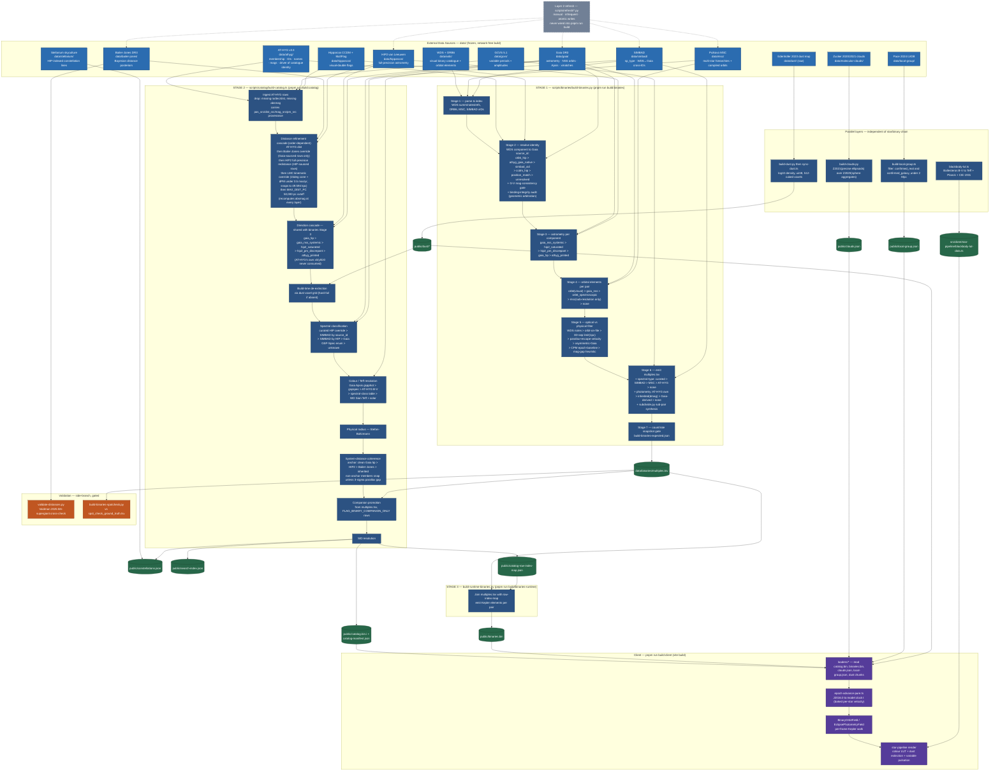

# Data pipeline flowchart

Mermaid flowchart of the full build pipeline: external data sources →
binary-system cross-match (`scripts/binaries/`) → single-star catalog
build (`scripts/catalog/`) → runtime binaries → parallel layers
(clouds, local group, dust, colour LUT) → validation → client
consumption. Node labels carry the reconciliation precedence chains
(distance refinement, direction cascade, binary identity resolution,
orbital-element precedence) rather than exploding each gate into its
own box — full detail for each stage lives in the corresponding
folder's `README.md` and `SCIENCE.md`.

Renders natively in GitHub's markdown viewer.

